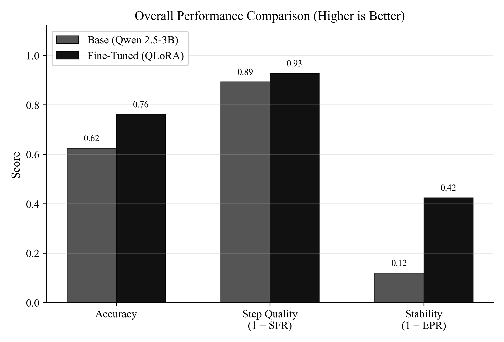
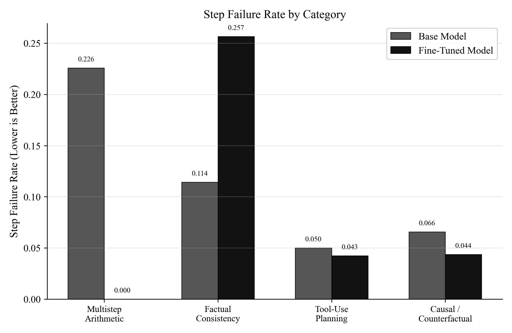

<div align="center">

# 🧠 LLM Reasoning Pipeline

**Step-Level Evaluation & Targeted Fine-Tuning for Language Model Reasoning**

[](https://python.org)
[](https://pytorch.org)
[](https://huggingface.co)
[](LICENSE)

*Most LLM benchmarks grade only the final answer. This pipeline grades **every intermediate reasoning step** — finding where models fail, why they fail, and using that data to fine-tune more effectively.*

[Quick Start](#-quick-start) · [Results](#-results) · [Architecture](#-architecture) · [Fine-Tuning](#-phase-2-fine-tuning) · [Contributing](#-contributing)

</div>

---

## 📌 Overview

Standard evaluation measures final-answer accuracy — a binary pass/fail that hides *where* reasoning breaks down. A model can arrive at a correct answer through flawed logic, or fail at step 7 due to an error introduced at step 3.

This pipeline introduces **step-level chain-of-thought evaluation** that:

- **Decomposes** LLM responses into individual reasoning steps
- **Evaluates** each step independently for logical validity
- **Tracks error propagation** — when a bad step cascades into a wrong answer
- **Detects hallucinations** and reasoning drift mid-chain
- **Mitigates** failures via RAG-based re-grounding
- **Fine-tunes** models on failure cases using QLoRA to fix the root causes

---

## 🏆 Results

### PPT Benchmark Snapshot (Groq 8B Judge, 8 Samples/Category)

Source artifact: `outputs/final_results_for_ppt_2026-03-31/sanity_3b_targeted_v3_groq8b_8.json`

| Model | Step Failure Rate | Final Accuracy | Error Propagation |
|:------|:-----------------:|:--------------:|:-----------------:|
| Qwen 2.5 3B (Base) | 4.50% | 87.5% | 50.0% |
| **Qwen 2.5 3B Targeted-v3 (Fine-tuned)** | **2.34%** | **90.6%** | 66.7% |

### Key Findings (PPT Run)

- Fine-tuned targeted-v3 reached **90.6% final accuracy** on the presentation sanity benchmark.
- Accuracy improved from **87.5% → 90.6%** ($+3.1$ points) vs the base 3B model.
- Step failure dropped from **4.50% → 2.34%** (almost half), indicating cleaner intermediate reasoning.

### Per-Category Accuracy (PPT Run)

| Category | Base 3B | FT Targeted-v3 |
|:---------|:-------:|:--------------:|
| Multistep Arithmetic | 50.0% | 62.5% |
| Factual Consistency | 100% | 100% |
| Tool-Use Planning | 100% | 100% |
| Causal/Counterfactual | 100% | 100% |

### Professional Visuals

The project includes publish-ready comparison visuals under `outputs/charts/`:





> Note: This PPT snapshot is a sanity benchmark designed for fast comparability. For publication-grade conclusions, pair it with larger-sample runs in `outputs/final_*_20.json`.

---

## ✨ Core Capabilities

- Step-level reasoning evaluation across multiple task families
- Per-step validity checking, drift detection, and hallucination scoring
- Failure-aware mitigation using retrieval and re-grounding
- Targeted QLoRA fine-tuning from failure traces
- GGUF export for fast local inference in Ollama
- Reproducible benchmark runs with JSON output artifacts

---

## 🚀 End-to-End Workflow (Train → Merge → GGUF → Ollama → Test → Eval)

The following sequence is the standard production flow for this project.

### 0) Environment Setup

```bash
git clone https://github.com/yashdoke7/llm-reasoning-pipeline.git
cd llm-reasoning-pipeline
python -m venv venv
venv\Scripts\activate
pip install -r requirements.txt
pip install -r requirements-finetune.txt
```

Create and edit `.env`:

```bash
copy .env.example .env
```

Set at least:

```env
GROQ_API_KEY=your_key_here
```

### 1) Build Frozen Splits and Audit Training Mix

Create deterministic train/validation/test splits first, then audit the training mix.

```bash
python data_loaders/build_frozen_splits.py --input outputs/finetune_dataset_normalized.jsonl --output-dir outputs
python finetune/audit_finetune_dataset.py
```

### 2) Fine-Tune (QLoRA)

```bash
python finetune/train_lora.py
```

### 3) Merge LoRA Adapter into Base Model

```bash
python finetune/merge_adapter.py
```

### 4) Build GGUF (FP16 Only)

Use bundled `llama.cpp` in repo root (already present here), or pass your own path.

```bash
python finetune/quantize.py --llama-cpp-dir llama.cpp --fp16-only
```

### 5) Create Ollama Model from GGUF

Update `Modelfile.merged` to point to your FP16 GGUF file:

```text
FROM ./outputs/quantized/model_fp16.gguf
```

Then create the model:

```bash
ollama create qwen2.5-3b-ft-fp16 -f Modelfile.merged
```

### 6) Smoke Test (2+2)

```bash
ollama run qwen2.5-3b-ft-fp16 "Solve quickly: 2+2 = ?"
```

### 7) Evaluation (Groq 8B Instant, 8 Samples)

Use 8-sample testing with `llama-3.1-8b-instant` as both solver and judge:

```bash
python experiments/run_baseline_eval.py \
        --provider groq \
        --models llama-3.1-8b-instant \
        --judge-provider groq \
        --judge-model llama-3.1-8b-instant \
        --samples 8 \
        --no-wandb \
        --mitigation-metrics none
```

If you want to evaluate your local fine-tuned Ollama model while still using Groq as judge:

```bash
python experiments/run_baseline_eval.py \
        --provider ollama \
        --models qwen2.5-3b-ft-fp16 \
        --judge-provider groq \
        --judge-model llama-3.1-8b-instant \
        --samples 8 \
        --no-wandb \
        --mitigation-metrics none
```

The evaluation harness now reads from `outputs/frozen_test_dataset.jsonl` and takes the first `N` items per category in sorted order, so the 8-sample and 20-sample comparisons stay fixed across reruns.

---

## ⚡ Quick Start

### Prerequisites

- Python 3.10+
- [Ollama](https://ollama.com) installed (for local inference) **or** a [Groq API key](https://console.groq.com) (free tier)
- NVIDIA GPU with 8GB+ VRAM (for fine-tuning only — evaluation runs on CPU)

### 1. Clone & Install

```bash
git clone https://github.com/yashdoke7/llm-reasoning-pipeline.git
cd llm-reasoning-pipeline
python -m venv venv
venv\Scripts\activate          # Windows
# source venv/bin/activate     # Linux/Mac
pip install -r requirements.txt
```

### 2. Configure

```bash
cp .env.example .env
# Edit .env with your API keys (Groq, W&B)
```

For **local inference** (recommended — free, no rate limits):
```bash
ollama pull qwen2.5:3b
```

Then set `provider: "ollama"` in `configs/config.yaml`.

### Submission Recovery Modes

Use one of these two stable evaluation modes for consistent results:

1) Local, no API limits (recommended while iterating)
```bash
python experiments/run_baseline_eval.py \
        --provider ollama \
        --models qwen2.5:14b \
        --judge-provider ollama \
        --judge-model qwen2.5:14b \
        --samples 20 --no-wandb --mitigation-metrics none
```

2) Cloud judge with automatic Groq key rotation on TPD exhaustion
```bash
# .env can include both keys:
# GROQ_API_KEY=...
# GROQ_API_KEY_2=...

python experiments/run_baseline_eval.py \
        --provider ollama \
        --models qwen2.5:14b \
        --judge-provider groq \
        --judge-model llama-3.3-70b-versatile \
        --samples 20 --no-wandb --mitigation-metrics none
```

To compare mitigation impact separately (instead of mixing with baseline), rerun with:
```bash
--mitigation-metrics rag
```
or
```bash
--mitigation-metrics best
```

### 3. Run Evaluation

```bash
# Quick test (10 samples, no W&B logging)
python experiments/run_baseline_eval.py --samples 10 --no-wandb

# Full evaluation
python experiments/run_baseline_eval.py

# Single model + category
python experiments/run_baseline_eval.py --models qwen2.5:3b --categories multistep_arithmetic --samples 50
```

### 4. Audit Dataset Mix (Prevent Category Mismatch)

Before fine-tuning, verify your training JSONL is not accidentally single-category heavy:

```bash
python finetune/audit_finetune_dataset.py
```

If one category dominates (for example arithmetic-only), regenerate a mixed dataset:

```bash
python finetune/dataset_builder.py \
        --category mixed \
        --samples 1200 \
        --provider ollama \
        --trace-model qwen2.5:14b \
        --quality-provider ollama \
        --quality-model qwen2.5:14b
```

Then re-audit:

```bash
python finetune/audit_finetune_dataset.py
```

### 5. Generate Static Charts

After evaluation, generate PNG charts in outputs/charts:

```bash
python experiments/generate_charts.py
```

Latest run only:

```bash
python experiments/generate_charts.py --latest-only
```

### 6. Run Manifests

Each evaluation now writes a run manifest JSON containing solver/judge settings,
dataset sources, completion counts, and output file references:

- `outputs/run_manifest_<run_suffix>.json`
- `outputs/run_manifest.json` (latest)

### 7. Updated Playbook (General + Physics)

For the latest end-to-end commands (including failure-targeted dataset building,
physics-specific benchmarking, and UI prompt workflows), see:

- `docs/EXECUTION_PLAYBOOK.md`
- `docs/DATASET_PROMPTS_UI.md`

---

## 🏗 Architecture

<div align="center">

</div>

```
┌─────────────────────────────────────────────────────────────────┐
│                        INPUT LAYER                              │
│  GSM8K · CRASS · Synthetic Tool-Use · Factual Consistency       │
└───────────────────────────┬─────────────────────────────────────┘
                            │
                            ▼
┌─────────────────────────────────────────────────────────────────┐
│                    INFERENCE LAYER                              │
│  Ollama (Local) ◄──► Groq Cloud API                             │
│  Qwen 2.5 3B · Llama 3.1 8B · Llama 3.3 70B                     │
└───────────────────────────┬─────────────────────────────────────┘
                            │
                            ▼
┌─────────────────────────────────────────────────────────────────┐
│                   EVALUATION ENGINE                             │
│  ┌──────────────┐  ┌────────────────┐  ┌────────────────────┐   │
│  │ Task         │  │ Step           │  │ Hallucination      │   │
│  │ Decomposer   │──│ Evaluator      │──│ Scorer + Drift     │   │
│  │              │  │ (per-step)     │  │ Detector           │   │
│  └──────────────┘  └───────┬────────┘  └────────────────────┘   │
│                            │                                    │
│                     ┌──────▼──────┐                             │
│                     │ Metrics     │                             │
│                     │ Aggregator  │                             │
│                     └──────┬──────┘                             │
└────────────────────────────┼────────────────────────────────────┘
                             │
                ┌────────────┼────────────┐
                ▼            ▼            ▼
       ┌──────────────┐ ┌────────┐ ┌──────────────┐
       │ RAG          │ │ Failure│ │ Fine-Tuning  │
       │ Mitigation   │ │ Report │ │ Pipeline     │
       │ (Wikipedia)  │ │ (.json)│ │ (QLoRA)      │
       └──────────────┘ └────────┘ └──────┬───────┘
                                          │
                                          ▼
                                  ┌───────────────┐
                                  │ GGUF Quantize │
                                  │ (llama.cpp)   │
                                  └───────┬───────┘
                                          │
                                          ▼
                                  ┌───────────────┐
                                  │ Re-Evaluation │
                                  │ (same harness)│
                                  └───────────────┘
```

### Pipeline Flow

1. **Data Loading** — Loads tasks from GSM8K (HuggingFace), CRASS, and synthetic generators
2. **Inference** — Sends chain-of-thought prompts to LLMs via Ollama (local) or Groq (cloud)
3. **Step Decomposition** — Parses the model response into individual reasoning steps
4. **Step Evaluation** — A meta-evaluator LLM grades each step as VALID / INVALID / UNCERTAIN
5. **Ground-Truth Backtrack** — If the final answer is wrong but all steps were marked VALID, re-evaluates to find the hidden failure point
6. **Hallucination Detection** — Flags unverifiable factual claims in reasoning chains
7. **RAG Mitigation** — Retrieves Wikipedia context to re-ground failing steps
8. **Failure Reporting** — Generates detailed JSON reports of where and why models fail
9. **Fine-Tuning** — Uses failure data to build targeted training sets; fine-tunes with QLoRA
10. **Quantization** — Converts to GGUF Q4/Q8 for efficient local inference
11. **Re-Evaluation** — Runs the fine-tuned model through the same evaluation harness

---

## 🔧 Phase 2: Fine-Tuning

**Requires:** NVIDIA GPU with 8GB+ VRAM (tested on RTX 4070)

### Install GPU Dependencies

```bash
pip install -r requirements-finetune.txt
```

### Step 1 — Build Training Dataset

Generates structured chain-of-thought training traces from failure analysis:

```bash
python finetune/dataset_builder.py --samples 100
```

### Step 2 — Fine-Tune with QLoRA

4-bit quantized training using LoRA adapters (fits in 8GB VRAM):

```bash
python finetune/train_lora.py
```

**Training config:** LoRA rank=16, alpha=32, targets=`[q_proj, v_proj, k_proj, o_proj]`, 3 epochs, cosine LR schedule

### Step 3 — Merge & Quantize

```bash
python finetune/merge_adapter.py
```

Then quantize to GGUF using llama.cpp:

```bash
git clone https://github.com/ggerganov/llama.cpp
cd llama.cpp && make -j$(nproc)
cd ..
python finetune/quantize.py
```

### Step 4 — Deploy to Ollama & Re-Evaluate

```bash
# Create Ollama model from GGUF
ollama create qwen2.5-3b-finetuned-q4 -f Modelfile

# Re-evaluate with same harness
python experiments/run_baseline_eval.py --models qwen2.5-3b-finetuned-q4 --samples 10 --no-wandb
```

---

## 📁 Project Structure

```
llm-reasoning-pipeline/
├── configs/
│   └── config.yaml              # Central configuration (models, eval, finetune settings)
├── models/
│   ├── groq_client.py           # Groq cloud API client (rate limiting, retries)
│   └── ollama_client.py         # Ollama local inference client
├── eval/
│   ├── task_decomposer.py       # CoT prompt builder + step parser
│   ├── step_evaluator.py        # Step-level meta-evaluation with backtracking
│   ├── hallucination_scorer.py  # Unverifiable claim detection
│   ├── drift_detector.py        # Contradiction + topic drift detection
│   └── metrics.py               # Aggregation + W&B logging
├── mitigation/
│   ├── retriever.py             # Wikipedia retriever for RAG
│   └── regrounder.py            # Re-grounds failing steps with context
├── finetune/
│   ├── dataset_builder.py       # Generates training data from failure cases
│   ├── train_lora.py            # QLoRA fine-tuning (PEFT + TRL)
│   ├── merge_adapter.py         # Merges LoRA adapters into base model
│   └── quantize.py              # GGUF export via llama.cpp
├── data_loaders/
│   ├── gsm8k_loader.py          # GSM8K auto-download (HuggingFace)
│   ├── crass_loader.py          # CRASS dataset + synthetic fallback
│   ├── toolbench_loader.py      # Synthetic tool-use task generator
│   └── factual_synthetic.py     # Factual consistency task generator
├── experiments/
│   └── run_baseline_eval.py     # Main evaluation runner
├── dashboard/
│   └── app.py                   # Streamlit visualization UI
├── docs/                        # Architecture diagrams, blueprints
├── outputs/                     # Results, reports, charts (auto-generated)
├── requirements.txt             # Core dependencies (CPU)
└── requirements-finetune.txt    # GPU fine-tuning dependencies
```

---

## 📊 Datasets

| Dataset | Category | Source | Auto-Download |
|:--------|:---------|:-------|:-------------:|
| **GSM8K** | Multi-step Arithmetic | HuggingFace | ✅ |
| **CRASS** | Causal/Counterfactual | [apergo-ai/CRASS](https://github.com/apergo-ai/CRASS) | ❌ (synthetic fallback included) |
| **Tool-Use** | Tool Planning | Synthetic generator | ✅ |
| **Factual** | Factual Consistency | Synthetic generator | ✅ |

---

## 📏 Metrics Reference

| Metric | What It Measures |
|:-------|:-----------------|
| **Step Failure Rate** | % of individual reasoning steps graded INVALID by the meta-evaluator |
| **Error Propagation Rate** | % of step failures that cascaded into incorrect final answers |
| **Hallucination Rate** | % of tasks containing ≥1 unverifiable factual claim |
| **Final Accuracy** | % of tasks with correct final answer |
| **Mitigation Delta** | Accuracy change after RAG re-grounding of failing steps |

---

## ⚙️ Configuration

All settings live in [`configs/config.yaml`](configs/config.yaml):

| Setting | Default | Description |
|:--------|:--------|:------------|
| `provider` | `"groq"` | `"groq"` for cloud API, `"ollama"` for local inference |
| `eval.samples_per_category` | `50` | Samples per task category (use 10 for quick tests) |
| `eval.temperature` | `0.1` | Low temperature for reproducible reasoning |
| `finetune.base_model` | `Qwen/Qwen2.5-3B-Instruct` | Base model for fine-tuning |
| `finetune.training.load_in_4bit` | `true` | QLoRA 4-bit quantized training |

---

## 🛣 Roadmap

- [x] Phase 1: Multi-model baseline evaluation across 4 reasoning categories
- [x] Phase 2: QLoRA fine-tuning + GGUF quantization + re-evaluation
- [ ] Phase 3: Paid model benchmarks (GPT-4o, Claude) as ceiling comparison
- [ ] Phase 3: Interactive Gradio demo for live model comparison
- [ ] Phase 3: Push fine-tuned model to Hugging Face Hub

---

## 🤝 Contributing

Contributions are welcome! Please open an issue or submit a pull request.

1. Fork the repository
2. Create a feature branch (`git checkout -b feature/improvement`)
3. Commit your changes (`git commit -am 'Add new feature'`)
4. Push to the branch (`git push origin feature/improvement`)
5. Open a Pull Request

---

## 📄 License

This project is licensed under the MIT License — see the [LICENSE](LICENSE) file for details.

---

## 📚 References

- [GSM8K: Training Verifiers to Solve Math Word Problems](https://arxiv.org/abs/2110.14168) — Cobbe et al., 2021
- [Chain-of-Thought Prompting Elicits Reasoning in Large Language Models](https://arxiv.org/abs/2201.11903) — Wei et al., 2022
- [QLoRA: Efficient Finetuning of Quantized Language Models](https://arxiv.org/abs/2305.14314) — Dettmers et al., 2023
- [LoRA: Low-Rank Adaptation of Large Language Models](https://arxiv.org/abs/2106.09685) — Hu et al., 2021
- [Let's Verify Step by Step](https://arxiv.org/abs/2305.20050) — Lightman et al., 2023

---

<div align="center">
<sub>Built by <a href="https://github.com/yashdoke7">Yash Doke</a></sub>
</div>
